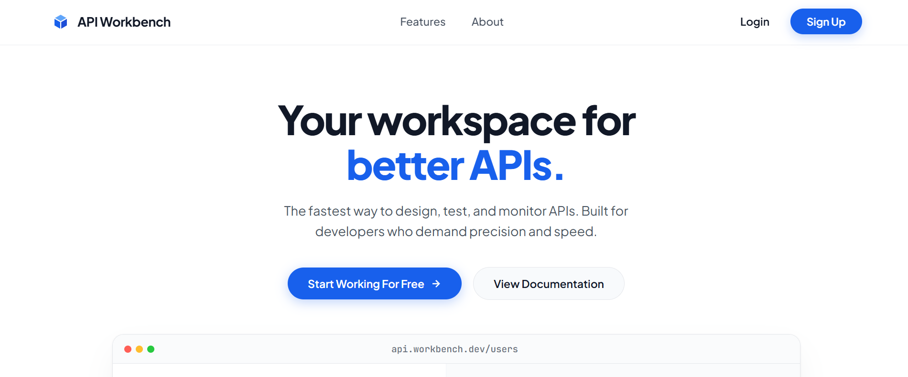
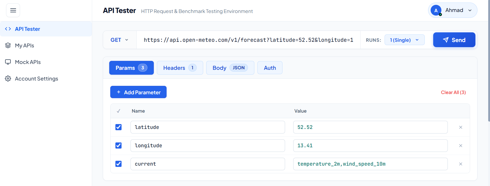
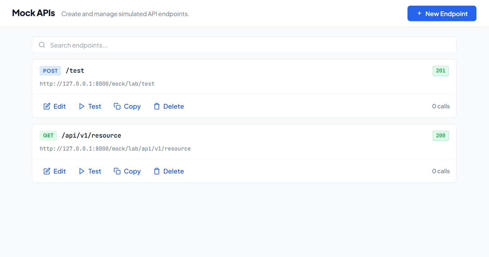
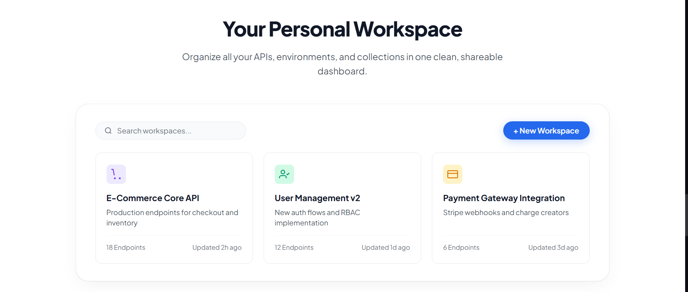

# API Workbench

API Workbench is a developer platform built for REST APIs over HTTP/HTTPS, enabling developers to test HTTP methods (GET, POST, PUT, PATCH, DELETE, HEAD, OPTIONS), create live mock REST endpoints, run concurrency benchmarks, and organize APIs into workspaces.

## Screenshots

### Landing Page


### API Tester & Benchmarking


### Mock API Server


### My APIs & Workspaces


## Key Features

- **HTTP Request Tester**: Send GET, POST, PUT, PATCH, DELETE, HEAD, and OPTIONS requests with headers, query parameters, auth tokens, and JSON payloads.
- **Live Mock Server**: Define mock endpoints with custom HTTP status codes, response delays, and authentication served under `/mock/*`.
- **Concurrency Benchmarking**: Run batch requests in parallel and monitor latency metrics (min, avg, max) and success rates.
- **Workspaces**: Organize and categorize saved API collections with custom themes and quick-launch testing.
- **Authentication**: JWT-based authentication with OTP email verification and password reset flows.

## Tech Stack

- **Frontend**: React 19, TypeScript, Vite, React Router v7, Vanilla CSS
- **Backend**: FastAPI, Python 3.10+, Uvicorn, SQLAlchemy, Pydantic v2, HTTPX
- **Database & Security**: SQLite, PyJWT, Cryptography, Bcrypt

## Installation & Setup

### Prerequisites

- Node.js (v18+)
- Python (v3.10+)

### Backend

1. Navigate to the `backend` directory:
   ```bash
   cd backend
   ```

2. Create and activate a virtual environment:
   ```bash
   python -m venv venv
   # Windows:
   venv\Scripts\activate
   # macOS/Linux:
   source venv/bin/activate
   ```

3. Install dependencies:
   ```bash
   pip install -r requirements.txt
   ```

4. Create the configuration file:
   ```bash
   cp .env.example .env
   ```

5. Start the backend server:
   ```bash
   uvicorn app.main:app --host 127.0.0.1 --port 8000 --reload
   ```

### Frontend

1. Navigate to the `frontend` directory:
   ```bash
   cd frontend
   ```

2. Install dependencies:
   ```bash
   npm install
   ```

3. Start the development server:
   ```bash
   npm run dev
   ```

### Quick Start (Windows)

Start both backend and frontend servers together:
```bat
./scripts/start_dev.bat
```

